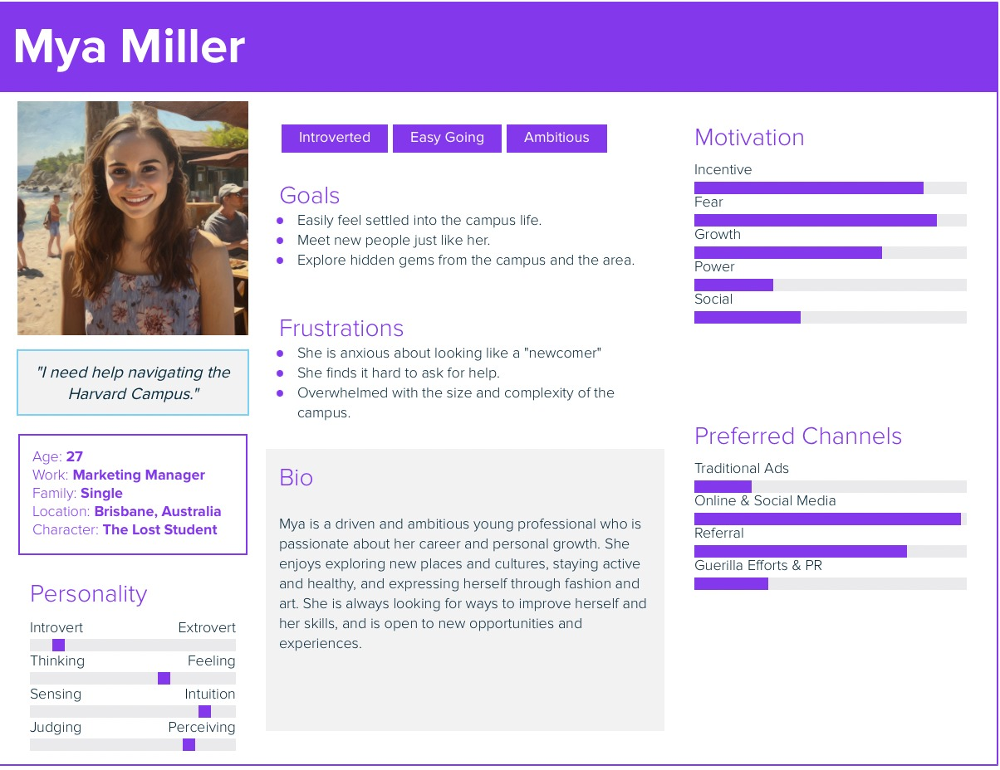

# IvyGuide

### Harvard Summer School 2023:  S-71 Agile
### Team: BurndownMasters
- Malaika Goswamy: Scrum Master, Developer
- Bharat Santhosh Raja: Developer
- Bradley Ross:  Product Owner, Developer

### tl:dr 
IvyGuide is a student-maintained web app providing a singular, informal location for all tips, tricks, 
guides, and necessary information for incoming Harvard summer school students living on campus. 

## Deliverable 1: June 26, 2023
1. Canvas Group: Burndown Masters Student Groups: https://canvas.harvard.edu/courses/119743/groups
2. Team Name: **BurndownMasters**  
Public Discord Channel: https://discord.gg/sBKM6RZy (depreciated)
Public Slack Channel: https://agilesoftwarecourse.slack.com/archives/C05E5KBS0E9
3. Public GitHub: https://github.com/bar181/BurndownMasters
4. Team Name: **BurndownMasters** 
   - Malaika Goswamy: Product Owner, Scrum Master
   - Bharat Santhosh Raja: Developer
   - Bradley Ross: Developer
5. Product Name: **IvyGuide**
6. Far Vision: **The Ultimate Orientation Resource for Students Everywhere** 
7. Near Vision: **Working prototype explaining orientation tips for new Harvard Summer Students**
8. Stakeholder Types: 
   - Harvard Summer School Students
   - Harvard Summer Residential Life Staff
   - Local Cambridge Community
   - Parents & Family of Students
9. Stakeholder Persona Real Names
   - Mya Miller, Internation student (Harvard Summer School Students)
   - Jamil Kikland, Dunster Hall Proctor (Harvard Summer Residential Life Staff) 
   - Noch, Owner of a Pizza restuarant in Harvard Square (Local Cambridge Community) 
   - Mya's Mom (Parents & Family of Students)
10. User Persona: **Mya Miller** 

11. Initial Product Backlog public link 
Link to Public Miro: https://miro.com/app/board/uXjVM73AdYc=/?share_link_id=542659522333
12. Product Backlog items - 11 total (see Miro)
13. User story for each (see Miro), 
14. Ordering in priority (see Miro) 
Rationale for ordering
    - 1st, ensure dependencies are complete (e.g. cannot rate a post until a post is created)
    - 2nd, make it easy to provide amazing, quality content targeted to our primary stakeholder (i.e. we want Mya to love our product) 
    - 3rd, add incremental value with additional features to enhance Mya's experience 
    - 4th, satisfy needs of other stakeholder types (e.g. make sure Mya's mom and Noch love our product too)
15. Definition of Ready   
    - Title: the user story has a relevant title 
    - User story opening sentence: the user story's opening statement directly relates to the content in the format 
    As a ___ (name/type of key stakeholder where possible), I want ____ (what), So that ___(why)
    - Additional details: list of backlog specific items and dependencies that area required before starting
    - Acceptance criteria: all team members have a mutual understanding of the story and the goal
    - Estimated in story points: Points should be from 1-3 based on effort as determined by dev members. For reference: 3 is the largest PBI allowed (e.g. intial set up), 1 is a minor feature (e.g. add rating) 
    It is encouraged to have backlog items at 1 but this is not required
    - Key functional tests (if required): Identify an input that will provide a desired outcome (e.g. shows the star rating out of 5)
    - Dependencies ready: List of any unique dependencies with confirmation of done (e.g. admin rights required for editing)
16. Estimates in relative size units - See Miro 
17. Whole team relative size: 20 Total Points across 11 backlog items 
Activity Name: **Agile Animals**  
    - Identify dev team skill sets
    - Group PBI into 3 classifications (1 small, 3 largest)
    - Classification done by dev team based on dev team experience/skill set not external benchmarks
    - Any PBI larger than 3 were decomposed as re-classified
18. Confirmation Dev-only estimates: 
Bharat <agree> 
Brad <agree>

## Deliverable 2: First Sprint June 29, 2023
1. Sprint planning: Story Point Forecast 8 
2. Rationale for forecast: Guess based on experience
Brad has some experience with setting up python and autothorization.
The hosting configuration timing is unknown (based on provider)
3. Sprint planning checklist
   - Stories from top of Product Backlog: TRUE
   - Aggregate size < forecast: TRUE
   - Developers participated: TRUE
   - Proof of Developer participation: TRUE (we attest)

    _TODO_image_DONE_

4. Backlog stories right size, <50% total effort, refine large items: TRUE
We needed to decompose items 
5. Tasks:
   - decompose PBI into task: 4 items (8 points)
   - tasks listed in sprint backlog: TRUE (total tasks: 16)
6. MIRO for sprint backlog: https://miro.com/app/board/uXjVM6jdFDo=/
7. Public sprint burndown chart: https://docs.google.com/spreadsheets/d/1aXzgwyhYiIOxKWGeQJib_VyrE4WT63Q_pTDonNz1vxI/edit?usp=sharing
8. Daily scrums: 2 completed

    _TODO_image_

   9. Member activity checklist
   Discussion occurred: TRUE for all scrum meetings
   Task list organized by PBI: all devs responsible, vital notes in comments, use dev initials and assign status

       DAILY SCRUM 1: June 28
   
       welcome to ivy guide page (2 story points) - IN PROCESS 2/4 TASKS COMPLETE
       - identify host (DONE by BA) Digital Ocean ;)
       - configure server (IN PROCESS - BA) Initial setup works, Flask not set up 
       - upload python environment (IN PROCESS - BA) - started
       - welcome message to visitors (DONE - BA) live content appears as expected

       local python setup (2) - IN PROCESS 2/4 TASKS COMPLETE
      - python setup (DONE BR) Pushed to github with commit 'Sprint 1: ready for 1st deploy' ;)
      - welcome note (IN PROCESS BR) 
      - navigation 
      - set up tests 
   
       User authorization (2)
      - database setup
      - log in and register page 
      - nav bar links 
      - error handling - register functionality

       provide useful tips online (2)
      - write 5 posts 
      - wireframe frontend style 
      - display dynamic content 
      - add frontend style framework 
   
       DAILY SCRUM 2: June 29

       welcome to ivy guide page (2 story points)
       - identify host (DONE by BA) Digital Ocean ;)
       - configure server (IN PROCESS - BA) Initial setup works, Flask not set up 
       - upload python environment (IN PROCESS - BA) - started
       - welcome message to visitors (DONE - BA) live content appears as expected

       local python setup (2) - DONE ;)
      - python setup (DONE BR) Pushed to github with commit 'Sprint 1: ready for 1st deploy' ;)
      - welcome note (DONE BR) Hero image with welcome text
      - navigation (DONE BR) Basic navbar with link to home page 
      - set up tests (DONE BR) set up unit_tests.py, test login/register form functionality formats
   
       User authorization (2) - UNABLE TO MEET DEADLINE 
      - database setup
      - log in and register page (IN PROCESS BR) - ui done, tests done, functionality not done
      - nav bar links (IN PROCESS BR) - link to register, login ready but not shown 
      - error handling - register functionality

       provide useful tips online (2) - DONE ;)
      - write 5 posts (DONE BR) 6 posts done
      - wireframe frontend style (DONE BR) - use card style with title and text
      - display dynamic content (DONE BR) - uses loop to show all tips (no database)
      - add frontend style framework (DONE BR) uses tailwindcss, daisyui

10. Impediments and Impediment recourse
Scrum June 28
    - python local config issues: SOLVED - revert commit, reinstall flask
    - python environments not the same across dev - high priority - TO SOLVE collaborate to ensure consistency that we can all code together
    - not sure if we can use existing repo with Digital Ocean - TO SOLVE research and test

11. Pair programming evidence:

    _TODO_image_2_images_total

12. Evidence of TDD with minimum 10 tests: 16 tests DONE (21 asserts)
13. Sprint Review: done
14. Product increment is working software

    _TODO_image_of software
    _TODO_URL_of_software
    _TODO_show_invitation_to_test_software

15. One stakeholder attends sprint review

    _TODO_image_
    Revisited backlog based on feedback: TRUE
    - feedback provided
16. Sprint retrospective: DONE
    - action to improve
    - new PBI added to top of PBI 
17. All BPI are true user stories